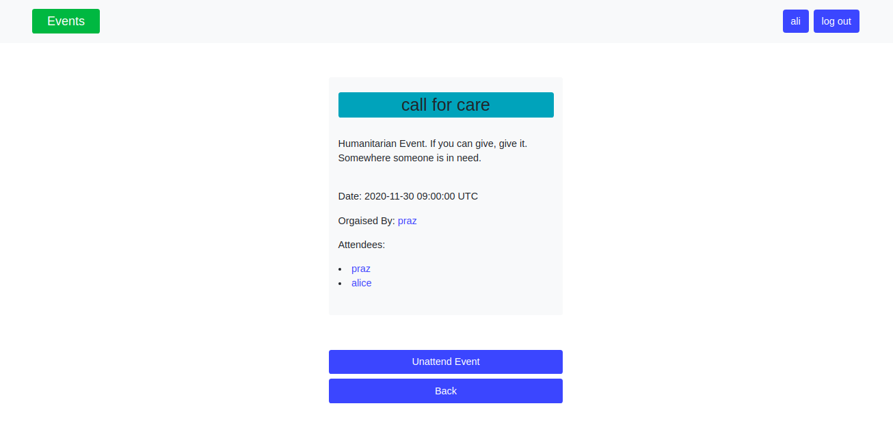

# Private Events

<!--
*** Thanks for checking out this README Template. If you have a suggestion that would
*** make this better, please fork the repo and create a pull request or simply open
*** an issue with the tag "enhancement".
*** Thanks again! Now go create something AMAZING! :D
-->

<!-- PROJECT SHIELDS -->
<!--
*** I'm using markdown "reference style" links for readability.
*** Reference links are enclosed in brackets [ ] instead of parentheses ( ).
*** See the bottom of this document for the declaration of the reference variables
*** for contributors-url, forks-url, etc. This is an optional, concise syntax you may use.
*** https://www.markdownguide.org/basic-syntax/#reference-style-links
-->
[![Contributors][contributors-shield]][contributors-url]
[![Forks][forks-shield]][forks-url]
[![Stargazers][stars-shield]][stars-url]
[![Issues][issues-shield]][issues-url]

<!-- PROJECT LOGO -->
<br />
<p align="center">
  <a href="https://github.com/praz99/private_events_self">
  </a>

  <br />
  <a href="https://github.com/praz99/private_events_self"><strong>Explore the docs »</strong></a>
  <br />
  <br />
  <a href="https://github.com/praz99/private_events_self/issues">Report Bug</a>
  ·
  <a href="https://github.com/praz99/private_events_self/issues">Request Feature</a>
</p>

<!-- TABLE OF CONTENTS -->
## Table of Contents

- [Table of Contents](#table-of-contents)
- [About The Project](#about-the-project)
- [Quick Start](#quick-start)
- [Installation](#installation)
- [Testing](#testing)
- [Built With](#built-with)
- [Contributing](#contributing)
- [Author](#author)
- [Acknowledgements](#acknowledgements)
- [📝 License](#license)

<!-- ABOUT THE PROJECT -->
## About The Project

Private events is an event management web app built as a part of ruby on rails module of [Microverse](https://www.microverse.org/)  main curriculum. In this app, users can create a new event or browse through all the existing events and attend (or unattend) them. The events attended by an user are listed under previously attended events or upcoming events in the users' profile page.
<!-- ABOUT THE PROJECT -->

## Main Features of the App
* Users can create an account for which just entering a name and an unique username is enough. No passwords required.
* Users can browse through all the existing events created by other users.
* Users can see the details of an event and choose to attend the event.
* Users can always choose to unattend the events they choose to attend earlier.
* A user can create new event.

## Live demo
[Here](https://still-meadow-93743.herokuapp.com/) is the live demo of my work.

## Built With

- Ruby version 2.7.1
- Ruby on Rails version 6.0.3.2

## Quick Start

### Prerequisite
* Install Ruby ([installation guide](https://www.ruby-lang.org/en/documentation/installation/))
* Install Ruby on Rails ([installation guide](https://guides.rubyonrails.org/getting_started.html#creating-a-new-rails-project-installing-rails))
* Git and Github

#### Get a local copy with:<br>
```js
git clone git@github.com:praz99/private_events_self.git
```

### Installation

After cloning the app, enter following commands in your terminal.
```js
bundle install
```
```js
yarn install --check-files
```
```js
rails db:create
```
```js
rails db:migrate
```
```js
rails server
```
Open https://localhost:3000/ in your browser

### Testing

To test the project

- Navigate to the directory where the project is located.
- Open terminal in this directory.
- Start testing by using `rspec` command.

## Contributing
Contributions, issues and feature requests are welcome! Start by:
* Fork the project.
* Clone the project to your local machine.
* `cd` into the project directory.
* Run `git checkout -b your-branch-name`.
* Make your contributions.
* Push your branch up to your forked repository.
* Open a Pull Request with a detailed description to the development branch of the original project for a review.
<!-- CONTACT -->
## Author

👤 **Prajwal Thapa** 
    
- LinkedIn: [prazwal-thapa](www.linkedin.com/in/prazwal-thapa/) 
- GitHub: [praz99](https://github.com/praz99)
- Twitter: [@thapa_praz](https://twitter.com/thapa_praz)
- E-mail: t.prazwal@gmail.com

## Show your support

Give a ⭐️ if you like this project!

<!-- ACKNOWLEDGEMENTS -->
## Acknowledgements
* [The Odin Project](https://www.theodinproject.com/courses/ruby-on-rails/lessons/associations#project-private-events)
* [Microverse](https://www.microverse.org/)

<!-- MARKDOWN LINKS & IMAGES -->
<!-- https://www.markdownguide.org/basic-syntax/#reference-style-links -->
[contributors-shield]: https://img.shields.io/github/contributors/praz99/private_events_self.svg?style=flat-square
[contributors-url]: https://github.com/praz99/private_events_self/graphs/contributors
[forks-shield]: https://img.shields.io/github/forks/praz99/private_events_self.svg?style=flat-square
[forks-url]: https://github.com/praz99/private_events_self/network/members
[stars-shield]: https://img.shields.io/github/stars/praz99/private_events_self.svg?style=flat-square
[stars-url]: https://github.com/praz99/private_events_self/stargazers
[issues-shield]: https://img.shields.io/github/issues/praz99/private_events_self.svg?style=flat-square
[issues-url]: https://github.com/praz99/private_events_self/issues

## License
- This project is MIT licensed.
